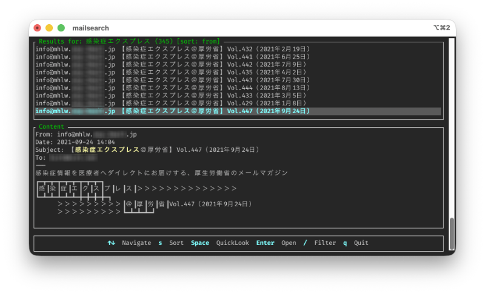

# mailsearch

A fast full-text search tool for Apple Mail `.emlx` files with an interactive terminal UI.



## Features

- **Fast full-text search** - Search through email content (subject, body, headers) for multiple terms with AND logic
- **Interactive TUI** - Browse and view results with a rich terminal interface built with Ratatui
- **Search highlighting** - Matching search terms are highlighted in yellow bold text
- **Flexible sorting** - Sort results by date (ascending/descending), subject, from, or to fields
- **Advanced filtering** - Filter results by sender, subject, date range, or full-text search
- **macOS integration** - QuickLook preview and open emails with default system applications
- **Performance optimized** - Parallel processing for unlimited searches, sequential with early termination for limited results
- **Smart email parsing** - Handles both plain text and HTML emails, strips HTML/CSS/JavaScript, preserves embedded newlines
- **Comprehensive metadata** - Displays From, To, Cc, Subject, and Date for each email

## Installation

```bash
cargo install --path .
```

Or build from source:

```bash
cargo build --release
```

The release binary will be at `target/release/mailsearch`.

## Usage

```bash
mailsearch [OPTIONS] <QUERY>
```

### Arguments

- `<QUERY>` - Search terms (space-separated, AND logic applied)

### Options

- `-r, --mail-root <DIR>` - Path to Apple Mail directory (default: `~/Library/Mail/V10`)
- `-l, --limit <N>` - Limit number of results (default: unlimited)

### Examples

Search with unlimited results:

```bash
mailsearch "rust programming"
```

Search with limited results:

```bash
mailsearch -l 20 "receipt invoice"
```

Search a custom mail directory:

```bash
mailsearch -r ~/Library/Mail/V2 "project update"
```

## TUI Controls

| Key | Action |
| :--- | :--- |
| `↑` / `↓` or `j` / `k` | Navigate results |
| `s` | Cycle sort order (no sort / date ↑ / date ↓ / subject / from / to) |
| `Enter` | Open email in default application |
| `Space` | QuickLook preview |
| `/` | Enter filter mode |
| `Esc` | Exit filter mode or clear active filter |
| `PgUp` / `PgDn` | Scroll content preview |
| `q` | Quit |

### Filter Mode

Press `/` to enter filter mode and type filters to refine results:

| Filter | Example | Description |
| :--- | :--- | :--- |
| (plain text) | `Hello` | Search across all fields (from, subject, content) |
| `from:` | `from:alice` | Filter by sender |
| `subject:` | `subject:meeting` | Filter by subject |
| `to:` | `to:bob@example.com` | Filter by recipient |
| `after:` | `after:2025-01-01` | Filter by date after (inclusive) |
| `before:` | `before:2025-12-31` | Filter by date before (inclusive) |

**Filter Tips:**

- Use quotes for multi-word values: `subject:"project update"`
- Combine multiple filters: `from:alice subject:meeting after:2025-01-01`
- Plain text searches across sender, subject, AND content
- Press `Enter` to apply, `Esc` to cancel
- Text filters are case-insensitive
- Clear active filter by pressing `Esc` in normal mode

## Requirements

- macOS (Apple Mail stores emails in macOS-specific format)
- Full Disk Access permission for Terminal or your terminal emulator

### Granting Full Disk Access

If you see permission errors, grant Full Disk Access:

1. Open **System Settings** > **Privacy & Security** > **Full Disk Access**
2. Add your terminal application (Terminal.app, iTerm2, etc.)
3. Restart your terminal

## How It Works

1. **Discovery** - Recursively finds all `.emlx` files in the mail directory
2. **Parsing** - Extracts headers and body content from each email, handling both plain text and HTML
3. **Search** - Searches extracted content for all query terms (AND logic)
4. **Display** - Shows results in interactive TUI with highlighted matches

## Development

```bash
# Run tests
cargo test

# Run with debug output
cargo run -- "query"

# Build optimized release
cargo build --release
```

## TODO

- [ ] Improve search performance
- [ ] Add more sort options (e.g., by attachment count)
- [ ] Export search results to file
- [ ] Save and load search queries

## License

MIT
