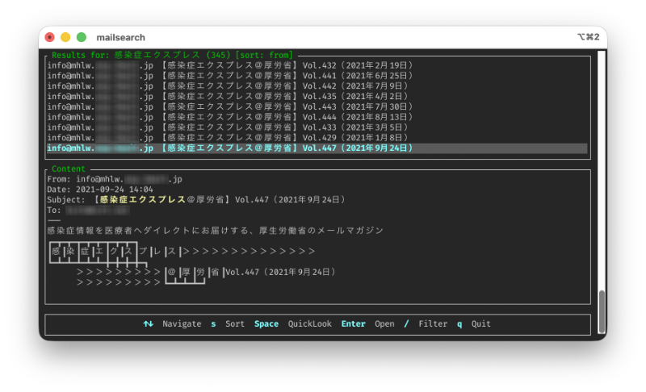

# mailsearch

A fast full-text search tool for Apple Mail `.emlx` files with an interactive terminal UI.



## Features

- **Fast full-text search** - Search through email content (subject, body, headers) for multiple terms with AND logic
- **Interactive TUI** - Browse and view results with a rich terminal interface built with Ratatui
- **Search highlighting** - Matching search terms are highlighted in yellow bold text
- **Recent-mail search** - `--this-week` / `--days N` restrict the search to a recent period, skipping most files without reading them. On a 230k-message mailbox this cuts CPU time by roughly 8x. See [Date windows](#date-windows).
- **Envelope Index pre-filter** - a `--from` search asks Apple Mail's own message database which files are worth opening, instead of reading all of them. On a 230k-message mailbox an unrestricted `--from` search went from 8.8s to 1.5s. Results are identical either way, and a missing or unreadable index just falls back to the full scan. See [Envelope Index](#envelope-index).
- **Flexible sorting** - Sort results by date (ascending/descending), subject, from, or to fields, interactively or via the `--sort` flag
- **Machine-readable output** - `--json` prints results to stdout for scripting; `--tsv` prints one TAB-separated line per result for `cut`/`awk`/`column`
- **Advanced filtering** - Filter results by sender, recipient, subject, date range, or full-text search
- **macOS integration** - QuickLook preview and open emails with default system applications
- **Performance optimized** - Parallel processing for unlimited searches, sequential with early termination for limited results
- **Smart email parsing** - Handles both plain text and HTML emails, strips HTML/CSS/JavaScript, preserves embedded newlines
- **Comprehensive metadata** - Displays From, To, Cc, Subject, and Date for each email; `--json` also emits `message_id` and a `timestamp`, so downstream tools can address a message without re-parsing the file

## Installation

```bash
cargo install --path .
```

Or build from source:

```bash
cargo build --release
```

The release binary will be at `target/release/mailsearch`.

## Usage

```bash
mailsearch [OPTIONS] <QUERY>
mailsearch [OPTIONS] --or <TERMS>...
mailsearch [OPTIONS] --from <PATTERN>
mailsearch [OPTIONS] --attachment-name <PATTERN>

mailsearch dump [OPTIONS] <TARGET>...          # print a message as text
mailsearch attachments [OPTIONS] <TARGET>...   # list or save its attachments
```

### Arguments

- `<QUERY>` - Search terms (space-separated, AND logic applied). Combine with `--or` for OR search (see below). Optional when the search is defined by `--or`, `--from` or `--has-attachment` instead.

  Quoting is optional: `mailsearch hello world` and `mailsearch "hello world"` are the same AND search. Put `--` first if a term itself starts with `-`, so it is not read as a flag.

  Terms are matched against the `Subject`, `From`, `To`, `Cc` and `Reply-To` headers as well as the body, so an address that never appears in the text is still findable (`mailsearch noreply@example.com`). A single AND-group may take one term from a header and another from the body.

### Options

- `-o, --or <TERMS>` - Add an OR group (repeatable). Each group is AND-matched internally, and groups are OR-combined. The whole search still runs in a single scan. Supplies the whole search when no `<QUERY>` is given. See [OR search](#or-search).
- `--from <PATTERN>` - Only match messages whose `From` header contains PATTERN. Repeatable, and repeats are OR-combined (`--from a --from b` = from either). Matched case-insensitively against the MIME-decoded header, so both the display name and the address work. AND-ed with the query. See [Filters](#filters).
- `--attachment-name <PATTERN>` - Only match messages with an attachment whose filename contains PATTERN. Repeatable, and repeats are OR-combined. Matched case-insensitively against the decoded name. See [Filters](#filters).
- `--has-attachment` - Only match messages carrying a real attachment. Embedded images (signature logos and the like) and detached cryptographic signatures (`smime.p7s`, `signature.asc`) do not count. See [Filters](#filters).
- `--no-index` - Ignore Apple Mail's Envelope Index and read every message file. An escape hatch; the results are the same either way, only slower. See [Envelope Index](#envelope-index).
- `-r, --mail-root <DIR>` - Path to Apple Mail directory (default: `~/Library/Mail/V10`)
- `-l, --limit <N>` - Limit number of results (default: unlimited)
- `--this-week` - Only search mail from the last 7 days. Shorthand for `--days 7`. See [Date windows](#date-windows).
- `--days <N>` - Only search mail from the last N days (max 36500). `--days 0` means today only. Cannot be combined with `--this-week`.
- `--sort <ORDER>` - Sort results before display/output. One of `none` (default), `date-asc`, `date-desc`, `subject`, `from`, `to`. When combined with `--limit`, results are sorted first and then truncated (i.e. the top-N).
- `--json` - Print results to stdout as a JSON array instead of launching the TUI. Each entry contains `subject`, `from`, `to`, `cc`, `date`, `timestamp` (Unix epoch seconds, `null` if the date could not be determined), `message_id` (angle brackets included, `null` if the message has none — e.g. an unsent draft), and `path`. The message body is omitted.
- `--tsv` - Print one TAB-separated line per result instead of launching the TUI: `date`, `from`, `subject`, `message-id`, `path`. No header row. Cannot be combined with `--json`. See [Machine-readable output](#machine-readable-output).

### Examples

Search with unlimited results:

```bash
mailsearch "rust programming"
```

Search with limited results:

```bash
mailsearch -l 20 "receipt invoice"
```

Search a custom mail directory:

```bash
mailsearch -r ~/Library/Mail/V2 "project update"
```

Output the 10 most recent matches as JSON (for scripting):

```bash
mailsearch --json --sort date-desc --limit 10 "receipt invoice" | jq '.[].subject'
```

Search only recent mail (much faster on a large mailbox):

```bash
mailsearch --this-week meeting
mailsearch --days 30 --sort date-desc invoice
```

### Working with a message you found

Searching tells you *which* message; `dump` and `attachments` are for reading it
and getting files out of it. Both take the same kind of `<TARGET>` — an `.emlx`
path or a `Message-ID` — so a search pipes straight into either:

```bash
# Read the most recent message from this sender
mailsearch --tsv --days 7 --from yamada | head -1 | cut -f5 | xargs mailsearch dump

# Save every attachment from this week's mail into ~/Inbox
mailsearch --tsv --this-week --from yamada --has-attachment | cut -f5 \
  | xargs mailsearch attachments --save ~/Inbox

# By Message-ID, brackets optional
mailsearch dump --days 30 '<TY0PR01MB0000ABCD@TY0PR01MB0000.prod.outlook.com>'
```

`dump` prints the headers, the attachment list, and the body. It prefers the
`text/plain` part and leaves its line breaks alone — unlike the search path's
extraction, which flattens whitespace because it only has to match a query.

- `--headers-only` - headers and attachment list, no body
- `--strip-quote` - drop the quoted reply and the signature
- `--html` - convert the HTML part even when a plain one exists

`attachments` lists them by default, or writes them out with `--save DIR`.
Existing files are never overwritten (`report.pdf`, `report_2.pdf`, …), and a
sender-supplied name cannot choose where the file lands. Embedded parts
(signature images) are skipped unless `--include-inline` is given.

Both accept `--days N`, which only matters when a `Message-ID` has to be looked
up: the Envelope Index stores a hash of the id rather than the id itself, so
that lookup scans, and a window is the difference between reading a few thousand
files and a quarter of a million.

**Neither ever asks Apple Mail for anything.** That keeps them fast and keeps
Mail's interface responsive, but it also means content Mail has not downloaded
is not there to read. Such attachments are listed with their real name and size
and marked `NOT DOWNLOADED` rather than reported as empty:

```
● 964173.partial.emlx
  外部260417 鈴木一郎.zip  (application/x-zip-compressed, 3,265,430 bytes, NOT DOWNLOADED)
```

Fetching them is Apple Mail's job, and driving Mail is deliberately left to a
separate tool.

### Attachment filenames

Attachment names come back decoded, which is more work than it sounds. Japanese
mail from Outlook writes them in three shapes, and the last two are both
non-standard:

- a plain `filename="report.pdf"`;
- an RFC 2047 encoded word inside a quoted string, which RFC 2047 does not
  permit but Outlook emits anyway;
- that encoded word split across RFC 2231 continuations (`filename*0`,
  `filename*1`, …) **mid-base64**, so the segments have to be joined before
  anything can be decoded.

On top of that the charset is usually ISO-2022-JP carrying NEC/IBM extension
characters — `①`, `㈱`, `髙` — which most decoders cannot represent. Names like
`新規260415 倫2026-001 山田太郎(迅速)学会.zip` survive all of it intact.

### Date windows

`--this-week` and `--days N` restrict the search to mail from a recent period. Because most files can be ruled out without being read, this is also the single biggest speedup available — on a 230,000-message mailbox, `--this-week` reduced CPU time from ~67s to ~8s.

Filtering happens in two stages:

1. **File modification time**, checked while walking the directory. For Apple Mail's `.emlx` files the file is written at or after the message date, and later edits only move its mtime forward, so a file older than the cutoff cannot hold a message inside the window and is skipped unread. This is what makes the window fast.
2. **The `Date:` header**, checked after parsing. This stage is required for correctness: changing a flag or moving a message rewrites the file, so a good fraction of the surviving candidates are old mail with a freshly bumped mtime. In practice roughly a third of stage-1 survivors are rejected here.

Things worth knowing:

- **The window is deliberately a little wider than requested.** The cutoff is midnight at the start of the day, so `--days 7` run in the afternoon covers 7 days plus that afternoon. The file-side cutoff (stage 1) is loosened by a further 2 days, so mail from a sender whose clock runs fast is not dropped unread.
- **`--days 0` means today**, not "no window". Omitting both flags is how you search everything.
- **Mail with a future date always matches**, since the window has no upper bound. Some spam sets its `Date:` header years ahead.
- **Mail with no readable `Date:` header falls back to the file's mtime**, so it is included when the file itself is recent rather than being silently dropped.
- **`--limit` alone does not give you the newest N.** It truncates in filesystem walk order. For the most recent matches, combine it with `--sort date-desc`. It counts distinct messages, not files (see [Duplicate copies](#duplicate-copies)).
- **Dates are displayed in UTC**, including the `since ...` line printed at startup, so they may differ from your wall clock.

### OR search

By default, multiple words in the query are combined with **AND** (`"Hello world"` matches messages containing both `Hello` and `world`). To search with **OR**, add one or more `--or` (`-o`) groups. Everything is evaluated in a single scan, so OR search costs the same as one AND search — no need to run the command multiple times.

The logic is a disjunction of conjunctions (DNF): spaces mean AND *within* a group, and groups are joined by OR.

```bash
# hello AND world
mailsearch "hello world"

# hello OR world OR today
mailsearch hello --or world --or today

# (urgent AND invoice) OR (至急 AND 請求)
mailsearch "urgent invoice" --or "至急 請求"

# Every group as --or: the positional query may be left out entirely
mailsearch --or world --or today
```

The first group may be written either way — `mailsearch hello --or world` and
`mailsearch --or hello --or world` are the same search. Leaving the positional
out keeps generated command lines uniform, so a caller assembling N terms need
not treat the first one differently.

All matched terms across every group are highlighted in the TUI.

### Filters

`--from`, `--has-attachment` and `--attachment-name` narrow the scan by header
and by message structure. They are AND-ed with the query and with each other, so they answer a
different kind of question than `--or` does — and either one is a complete
search on its own, with no query at all:

```bash
# Every message this person sent in the last three weeks that carries a file
mailsearch --days 21 --from t.suzuki --has-attachment

# Three correspondents who share a surname, across their three addresses
mailsearch --days 21 --from yamada8010 --from yamada-hiroshi --from yamada-m

# Still AND-ed with the query: invoices from this sender
mailsearch invoice --from accounts@example.com

# The zip the committee office sent, by what it was called
mailsearch --attachment-name '倫2026-001'
```

`--from` exists because the query itself is matched against the headers *and*
the body, so searching for an address also finds every reply that quotes it.
Restricting to the sender is what the query cannot express.

`--attachment-name` answers a question nothing else can: neither the query nor
Apple Mail's own search looks at attachment filenames, so a file you remember
receiving but not the wording of the mail was findable only from memory. It
matches the decoded name (see [Attachment filenames](#attachment-filenames)) and
ignores embedded images, so it will not hit every message with an `image001.png`.

Neither attachment filter is pushed down to the Envelope Index, even though the
index holds attachment names — that table is incomplete; see
[Envelope Index](#envelope-index).

`--has-attachment` inspects only the MIME structure, never the payload, so it
works on messages Apple Mail has not fully downloaded yet
(`*.partial.emlx`) — the part headers and filenames are present even when the
content is not.

Deciding what counts as an attachment is the fiddly part. Two kinds of part look
exactly like an attachment and are excluded:

- **Embedded images.** A signature logo is a named image part like any other.
  See `part_is_attachment` in `src/email.rs` for the two shapes these arrive in.
- **Detached signatures.** S/MIME and PGP signed mail carries `smime.p7s` or
  `signature.asc` as a sibling part declared `Content-Disposition: attachment`,
  which no structural test can tell from a real file. Nobody looking for "mail
  with an attachment" means a signed bank notification, and Apple Mail does not
  list these as attachments either. On real mail they were **83 of the 831**
  messages returned over 90 days. `application/pkcs7-mime` is *not* excluded: it
  wraps the real message and can carry genuine attachments.

### Machine-readable output

`--json` emits the full metadata for each result. `--tsv` emits the same
identifying fields as one TAB-separated line per result, in this column order:

```
date <TAB> from <TAB> subject <TAB> message-id <TAB> path
```

There is no header row, so the output pipes straight into the usual tools:

```bash
# The candidate list, as a readable table
mailsearch --tsv --days 21 --from t.suzuki --has-attachment | cut -f1-3 | column -t -s$'\t'

# Just the paths, to hand to another tool
mailsearch --tsv --days 21 --from t.suzuki --has-attachment | cut -f5
```

TAB is the separator because a tab cannot survive inside a header value, where
it counts as folding whitespace, while a printable separator such as `|` does
appear in real subjects. Should a value contain a tab anyway, it is replaced
with a space so the column count stays fixed.

### Envelope Index

Apple Mail keeps a SQLite database at `MailData/Envelope Index` with one row per
message, including the sender. When a search carries `--from`, that database is
asked which messages could possibly match, and only those files are opened.

```
mailsearch --from tezuka        8.8s  ->  1.5s     # 230k-message mailbox
```

**The index only ever removes candidates.** Every file it keeps is still parsed
and matched from the `.emlx` itself, so a search returns the same results with
and without it — `--no-index` is available to confirm that, not to change the
answer. Two consequences are worth knowing:

- **A missing or unreadable index is not an error.** No Full Disk Access, a
  locked database, or a schema a future macOS reshapes all fall back to the full
  scan silently.
- **Files the index does not know about are kept, never dropped.** Mail leaves
  `.emlx` files behind that the database no longer references; a real mailbox
  held 233,847 files against 231,469 indexed messages, and one of those 2,552
  orphans was a legitimate search hit. Reading them is the floor on how fast an
  indexed search can be, and the price of never losing a message.

Only `--from` is pushed down to the index. Two filters deliberately are not:

- **`--has-attachment`** — Mail's `attachments` table is a record of what it
  happened to index, not of which messages have attachments. On a real mailbox
  32 messages carrying ordinary `.docx`/`.xlsx`/`.pptx` files had no attachment
  row at all, so requiring one would have silently lost every one of them. Only
  the MIME walk can answer this.
- **`--this-week` / `--days N`** — the index stores a received date, which
  matches neither the `Date:` header the scan compares against nor the file
  mtime it pre-filters on. Pushing it down would change which messages a window
  contains rather than merely narrowing the files read. The two mechanisms
  compose instead: the index picks the senders, the mtime pass picks the window.

### Duplicate copies

Apple Mail keeps more than one `.emlx` for the same message — adjacent sequence
numbers within a mailbox, plus a stale file left behind when a message is moved
from INBOX to Archive. A raw scan therefore sees the same message two or three
times; measured on real mail, 11 messages with attachments were found as 22
files.

**Results are collapsed by `Message-ID`, so each message is reported once.** Of
the copies, a fully downloaded file is preferred over a `*.partial.emlx`, so the
`path` can be read from disk without asking Apple Mail for the body. Messages
with no `Message-ID` (an unsent draft, say) are never merged: there is no
identity to merge them by. `total_seen` still counts files, so the "no .emlx
found" diagnostic is unaffected.

## TUI Controls

| Key | Action |
| :--- | :--- |
| `↑` / `↓` or `j` / `k` | Navigate results |
| `s` | Cycle sort order (no sort / date ↑ / date ↓ / subject / from / to) |
| `Enter` | Open email in default application |
| `Space` | QuickLook preview |
| `/` | Enter filter mode |
| `Esc` | Exit filter mode or clear active filter |
| `PgUp` / `PgDn` | Scroll content preview |
| `q` | Quit |

### Filter Mode

Press `/` to enter filter mode and type filters to refine results:

| Filter | Example | Description |
| :--- | :--- | :--- |
| (plain text) | `Hello` | Search across all fields (from, subject, content) |
| `from:` | `from:alice` | Filter by sender |
| `subject:` | `subject:meeting` | Filter by subject |
| `to:` | `to:bob@example.com` | Filter by recipient |
| `after:` | `after:2025-01-01` | Filter by date after (inclusive) |
| `before:` | `before:2025-12-31` | Filter by date before (inclusive) |

**Filter Tips:**

- Use quotes for multi-word values: `subject:"project update"`
- Combine multiple filters: `from:alice subject:meeting after:2025-01-01`
- Plain text searches across sender, subject, AND content
- Press `Enter` to apply, `Esc` to cancel
- Text filters are case-insensitive
- `after:` / `before:` compare against the date shown in the results list, which is UTC
- Clear active filter by pressing `Esc` in normal mode

## Requirements

- macOS (Apple Mail stores emails in macOS-specific format)
- Full Disk Access permission for Terminal or your terminal emulator

### Granting Full Disk Access

If you see permission errors, grant Full Disk Access:

1. Open **System Settings** > **Privacy & Security** > **Full Disk Access**
2. Add your terminal application (Terminal.app, iTerm2, etc.)
3. Restart your terminal

## How It Works

1. **Discovery** - Recursively finds all `.emlx` files in the mail directory. With `--from`, Apple Mail's Envelope Index is consulted first and files it rules out are dropped before anything else (see [Envelope Index](#envelope-index)). With `--this-week` / `--days N`, files whose modification time predates the window are dropped here without being read (see [Date windows](#date-windows))
2. **Parsing** - Slices the RFC 822 message out of the `.emlx` using its byte-count line, so Mail's trailing property list never reaches the parser, then extracts headers and body content, handling both plain text and HTML. The `Date:` header is resolved first, so mail outside the window is discarded before the expensive body extraction
3. **Search** - Searches extracted content for the query terms (AND within a group, OR across `--or` groups)
4. **Display** - Shows results in interactive TUI with highlighted matches

## Development

```bash
# Run tests
cargo test

# Run with debug output
cargo run -- "query"

# Build optimized release
cargo build --release
```

### Key Dependencies

- `clap` - CLI argument parsing
- `mailparse` - `.emlx` / MIME parsing
- `chrono` - date parsing, formatting, and the `--this-week` / `--days` windows
- `walkdir` - recursive mail directory traversal
- `rusqlite` - reads Apple Mail's Envelope Index (bundled SQLite; opened read-only)
- `ratatui` + `crossterm` - interactive terminal UI
- `rayon` - parallel search
- `indicatif` - progress bars and spinners
- `serde` + `serde_json` - JSON output (`--json`)

## TODO

- [ ] Improve search performance further (date windows help a lot, but an unrestricted search still reads every file)
- [ ] Add more sort options (e.g., by attachment count)
- [ ] Export search results to file
- [ ] Save and load search queries

## License

MIT
